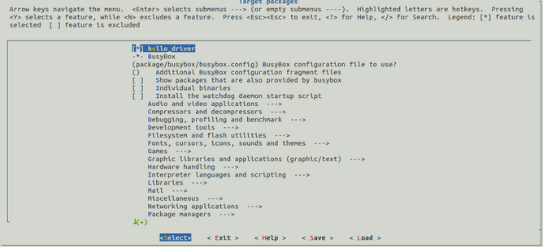
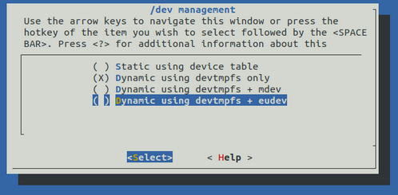

# Sensor bh1750

Configurações para incluir [esse módulo](https://github.com/LeonardoSanBenitez/sensor_bh1750_linux_driver) no sistema e carregá-lo durante a inicialização

# Adding modules to buildroot

Tutorial: https://techfortalk.co.uk/2017/06/15/how-to-addcompile-a-kernel-module-as-a-new-buildroot-package/

Buildroot docs: https://buildroot.org/downloads/manual/manual.html#_infrastructure_for_packages_building_kernel_modules

It is the same process to include any software: https://www.embarcados.com.br/linux-customizado-usando-rpi-e-buildroot/

How to add init script: https://cellux.github.io/articles/diy-linux-with-buildroot-part-2/

The toolchain that compiles my driver is in `buildroot/output/host/usr/bin/arm-none-linux-gnueabi-c++`

You can select your new module at menuconfig:



Instructions to enable I2C in `make linux-menuconfig`: https://unix.stackexchange.com/questions/185044/buildroot-missing-i2c-kernel-modules

To use I2C you *may* have to enable fynamic device management: system configuration → /dev management



O bh1750 tem um i2c atípico e só aparece no i2cdetect se usar a flag -r (segundo o help do i2cdetect, *“Use SMBus "read byte" commands for probing (by default, the command used is the one believed to be the safest for each address). Not recommended. This is known to lock SMBus on various write-only chips (most notably clock chips at address 0x69).*”

# Useful commands

```bash
make 

make sensor_bh1750-rebuild

make menuconfig

rm -r /home/benitez/buildroot-labs/buildroot/output/build/sensor_bh1750/

sudo tar -C /media/benitez/rootfs/ -xf /home/benitez/buildroot-labs/buildroot/output/images/rootfs.tar

# Access with root, 123456
picocom -b 115200 /dev/ttyUSB0

# O sensor foi conectado na I2C 1.
i2cdetect -ry 1

#Kernel messages about i2c
dmesg | grep i2c

# Load module manually
modprobe hello_driver
```

